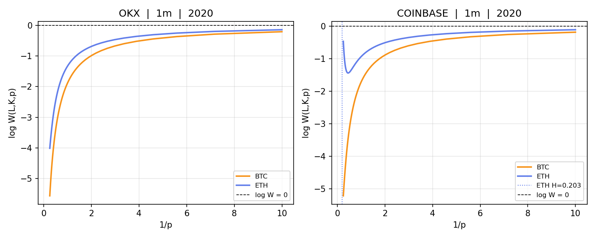

# Multifractality & Rough Volatility: Cross-Exchange Replication Study

Replicates and extends Pontiggia (2025) *"Multifractality in Bitcoin Realized Volatility: Implications for Rough Volatility Modelling"* ([arXiv:2507.00575v3](https://arxiv.org/abs/2507.00575)) by testing whether the paper's findings are robust across BinanceUS, OKX, and Coinbase (geoblocked from Binance and Bybit), and whether they extend to Ethereum. Data spans 2017–2025 where available; analysis covers 2020–2024.

## Quick Start

```bash
conda env create -f environment.yml
conda activate multifractal-vol

python src/data/fetch.py --config config.yaml
python src/data/preprocess.py --config config.yaml
python src/data/realized_vol.py --config config.yaml
python src/estimation/roughness.py --config config.yaml

# Or run everything:
bash run_pipeline.sh
```

## Repository Structure

```
multifractal-volatility/
├── data/
│   ├── raw/                    # Raw OHLCV parquet files per exchange/asset
│   └── processed/              # Cleaned realized volatility series
├── src/
│   ├── data/
│   │   ├── fetch.py            # CCXT data fetching with pagination
│   │   ├── preprocess.py       # 90-day window selection, completeness filter
│   │   └── realized_vol.py     # RV_t = |r_t| and noise-robust variant
│   ├── estimation/
│   │   ├── p_variation.py      # Cont-Das W(L,K,p) estimator
│   │   └── roughness.py        # Roughness index and K-stability diagnostics
│   ├── diagnostics/
│   │   ├── stationarity.py     # ADF, rolling stability, structural breaks
│   │   ├── mfdfa.py            # MF-DFA + shuffle control
│   │   ├── moment_scaling.py   # Log-log moment scaling (zeta_q)
│   │   └── wavelet_leaders.py  # Wavelet leaders multifractal analysis
│   └── visualization/
│       ├── p_variation_plots.py
│       ├── multifractal_plots.py
│       └── comparison_plots.py
├── notebooks/
│   ├── 01_data_exploration.ipynb
│   ├── 02_roughness_estimation.ipynb
│   ├── 03_multifractality.ipynb
│   └── 04_cross_exchange_comparison.ipynb
├── results/
│   ├── tables/
│   └── figures/
├── tests/
│   └── test_estimators.py
├── config.yaml
├── requirements.txt
├── environment.yml
└── run_pipeline.sh
```

## Key Methods

### Cont-Das p-Variation Estimator

For series `X` with `L` observations, partition into `K` blocks of size `n = L/K`:

```
S_j = sum_{i=(j-1)n+1}^{jn} X_i          # block sum
W(L, K, p) = (1/K) * sum_{j=1}^K |S_j|^p  # normalised p-variation
```

`K_opt = floor(sqrt(N))` (Cont-Das recommendation). The roughness index `H = 1/p*` where `log W(L, K, p*) = 0`.

### MF-DFA

Generalised Hurst exponent `H(q)` estimated via `log F_q(s) ~ H(q) log s`. Curvature in `H(q)` vs `q` signals multifractality. Shuffle control removes temporal dependence to isolate dynamic from distributional multifractality.

## Findings

Data was obtained from BinanceUS, Coinbase, and OKX (geoblocked from Binance and Bybit). 80 series total across both assets, all 4 frequencies, and up to 5 years (2020–2024) per exchange.

### Roughness index (p-variation)

On the standard grid [0.1, 4.0], **H = NaN for all 80 series** — log W(L, K, p) remains strictly negative and no zero-crossing occurs. This replicates Pontiggia (2025)'s central finding on Bitstamp and confirms it holds across BinanceUS, OKX, and Coinbase for both BTC and ETH.

When the p-grid is extended to [0.01, 10.0], **4 series produce confirmed in-grid zero-crossings**: all 4 frequencies of Coinbase ETH/USDT in 2020. The log W curve crosses zero at p* > 4, yielding a valid roughness index in all cases.

| Exchange | Asset | Frequency | Year | H (standard grid) | H (wide grid [0.01, 10.0]) | log W_max (standard) |
|----------|-------|-----------|------|:-----------------:|:--------------------------:|:--------------------:|
| Coinbase | ETH/USDT | 1m  | 2020 | 0.203 (extrapolated) | 0.224 (confirmed) | −0.106 |
| Coinbase | ETH/USDT | 5m  | 2020 | 0.158 (extrapolated) | 0.204 (confirmed) | −0.104 |
| Coinbase | ETH/USDT | 10m | 2020 | 0.133 (extrapolated) | 0.195 (confirmed) | −0.104 |
| Coinbase | ETH/USDT | 15m | 2020 | 0.099 (extrapolated) | 0.184 (confirmed) | −0.103 |

All four H values fall in [0.10, 0.22], indicating very rough volatility well below the H = 0.5 Brownian benchmark. The result is consistent across all 4 frequencies, ruling out a sampling artifact. A likely explanation is lower liquidity and thinner orderbooks for ETH on Coinbase in early 2020, which would produce a different microstructure fingerprint compared to mature BTC markets or later years.

### Cross-exchange consistency

| Exchange | Asset | Mean log W_max (standard grid) | Range |
|----------|-------|-------------------------------|-------|
| BinanceUS | BTC | −0.179 | single year |
| OKX | BTC | −0.200 | single year |
| Coinbase | BTC | −0.195 | −0.149 to −0.258 across 5 years |
| BinanceUS | ETH | −0.163 to −0.191 | varies by year |
| OKX | ETH | −0.136 to −0.141 | 3 years |
| Coinbase | ETH | −0.103 to −0.165 | varies by year |

The more negative log W_max, the further the curve is from a zero-crossing. OKX BTC at 1m (−0.205) is the most definitively rough series. Coinbase ETH 2020 (−0.103 to −0.106) is the least rough, consistent with its confirmed crossing at p* > 4.

### BTC vs ETH log W(L,K,p) curves — 2020, 1m



OKX shows both assets firmly below zero with no crossing. Coinbase shows the ETH curve approaching and crossing zero (H ≈ 0.224), while BTC remains strictly negative — the clearest visualisation of the BTC/ETH divergence in early 2020.

### BTC vs ETH

ETH has a systematically higher (less negative) log W_max than BTC — mean −0.160 vs −0.194. The gap is most pronounced on Coinbase where 2020 ETH is the only series to yield a roughness index. For all other years and exchanges, ETH's log W curve approaches zero more closely than BTC but still does not cross within the standard grid.

### Frequency robustness

The no-crossing result on the standard grid holds uniformly at 1m, 5m, 10m, and 15m. The confirmed crossings on the wide grid also hold at all 4 frequencies for Coinbase ETH 2020, with H decreasing slightly at lower frequencies (1m: 0.224 → 15m: 0.184).

## Citation

```
Pontiggia, M. (2025). Multifractality in Bitcoin Realized Volatility: Implications
for Rough Volatility Modelling. arXiv:2507.00575v3.
```
